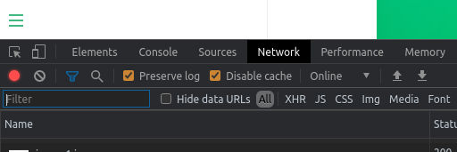

# XYZ Docs


- Unordered
- List

1. Ordered
2. List

[Link](https://link)

## Heading 2

Lorem ipsum dolor sit amet, consectetur adipisicing elit, sed do eiusmod
tempor incididunt ut labore et dolore magna aliqua. Ut enim ad minim veniam,
quis nostrud exercitation ullamco laboris nisi ut

### Heading 3

Code Snippet Sample

```css
.xyz {
  background: red;
}
```

## Heading 2 Two

aliquip ex ea commodo consequat. Duis aute irure dolor in reprehenderit in voluptate velit esse cillum dolore eu fugiat nulla pariatur. Excepteur sint occaecat cupidatat non proident, sunt in culpa qui officia deserunt mollit anim id est laborum.

!> **Important** notice with `inline code` and additional placeholder text used
to force the content to wrap and span multiple lines.

?> **Tip** notice with `inline code` and additional placeholder text used to
force the content to wrap and span multiple lines.

## How to develop



While in development to update page you have to check **disable cache**

You can learn how to write markdown [here](https://jhildenbiddle.github.io/docsify-themeable/#/markdown)
